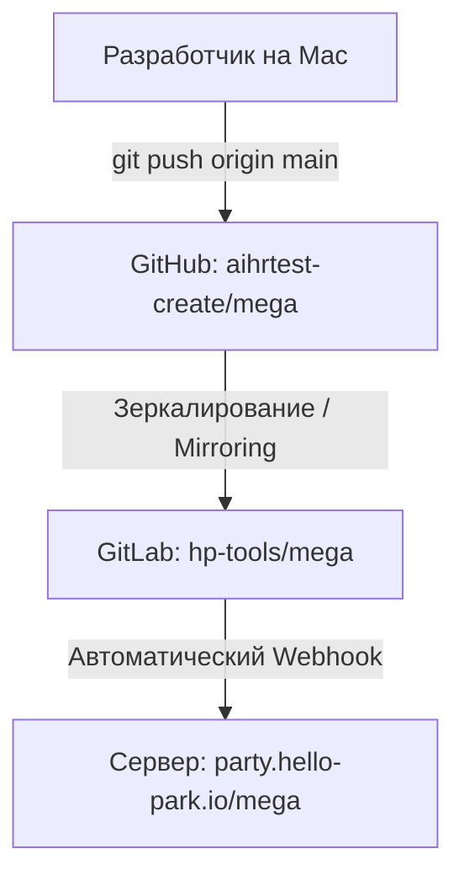

# Инструкция по деплою проекта (GitHub -> GitLab Mirroring -> Webhook Deploy)

В данном проекте настроена схема автоматического деплоя через зеркалирование репозиториев (Mirroring) из GitHub в GitLab. Это решает проблему сетевых блокировок GitLab на локальном компьютере разработчика.

---

## 1. Схема деплоя



### Как это работает:
1. Вы работаете локально на компьютере и пушите изменения на **GitHub** (ваш локальный `origin` настроен на GitHub).
2. **GitLab** настроен в режиме зеркала: он автоматически забирает все новые коммиты из GitHub.
3. При обновлении репозитория в GitLab срабатывает **Webhook**, настроенный вашим IT-специалистом. Webhook отправляет запрос на сервер, который выполняет `git pull` и перезапускает проект в Docker-контейнере.

---

## 2. Как сделать деплой локально?

Вы делаете деплой стандартным образом:
```bash
git add .
git commit -m "Сообщение об изменениях"
git push origin main
```
*Поскольку локальный `origin` указывает на GitHub, пуш сработает без сетевых ошибок. Изменения появятся на продакшене через пару минут после автоматической синхронизации с GitLab.*

---

## 3. Настройка Nginx и лимита загрузок

В файле `nginx.conf` проекта добавлена директива для снятия лимита загрузки файлов в 1 МБ (для поддержки загрузки изображений/медиа):
```nginx
server {
    listen 80;
    server_name _;
    client_max_body_size 50m; # Лимит увеличен до 50 МБ
    ...
}
```
Эта директива будет применена при следующем автоматическом обновлении контейнера на сервере.
