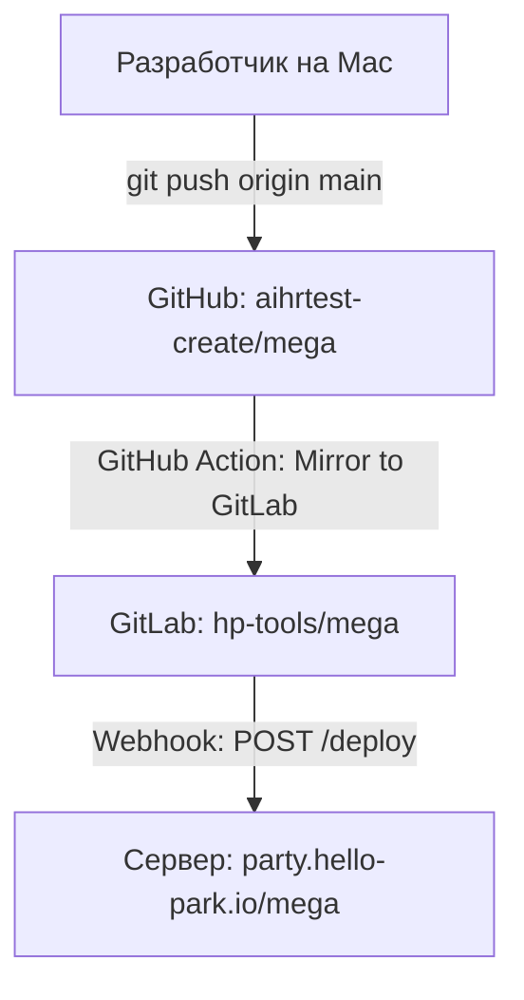

# Инструкция по деплою проекта (GitHub → GitLab Mirroring → Webhook Deploy)

В проекте настроен автоматический деплой через зеркалирование репозиториев из GitHub в GitLab. Это решает проблему сетевых блокировок GitLab на локальном компьютере разработчика. Схема проверена и работает (последняя сверка: 13.07.2026).

---

## 1. Схема деплоя



### Как это работает

1. Вы пушите изменения на **GitHub** (локальный `origin` указывает на GitHub).
2. GitHub Action **«Mirror to GitLab»** ([.github/workflows/mirror.yml](../.github/workflows/mirror.yml)) пушит ветку `main` в GitLab `hp-tools/mega`.
3. GitLab-вебхук шлёт POST на `https://party.hello-park.io/deploy`.
4. Сервер выполняет `/opt/mega-deploy.sh`: `git reset --hard origin/main`, затем `docker compose up -d --build --remove-orphans`.

Полный цикл — **~3 минуты**. Если коммит менял `package.json`/`package-lock.json`, дольше: сбрасывается кэш `npm install` в докере.

---

## 2. Как сделать деплой

```bash
git add .
git commit -m "Сообщение об изменениях"
git push origin main
```

### Как убедиться, что деплой доехал

```bash
curl -s https://party.hello-park.io/mega/ | grep -oE 'index-[A-Za-z0-9_-]+\.js'   # хэш бандла должен смениться
curl -sI https://party.hello-park.io/mega/ | grep -i last-modified               # время сборки на сервере
```

Коммит, не меняющий исходники (только документация, CI-файлы), сайт не изменит — докер возьмёт сборку из кэша. Это нормально.

### Перезапуск деплоя без пуша

GitLab → Settings → Webhooks → **Test → Push events** (или Resend Request на последней доставке).

---

## 3. Правила и грабли

- **Не переписывать историю `main` на GitHub** (rebase, force-push): зеркалирование идёт без `--force`, сервер делает `reset --hard`. Разъехавшаяся история — главная причина «пуш прошёл, а сайт старый» (случилось 13.07.2026, чинили через IT).
- **Фронтенд собирается внутри докер-образа** (multi-stage [Dockerfile](../Dockerfile)). Папка `dist/` git'ом не отслеживается и на деплой не влияет. `git pull` на сервере без пересборки образа сайт НЕ обновляет.
- **`.dockerignore` обязателен** (корень и `server/`): без него в образ утекают `.git` (~200 МБ), `node_modules`, а в бэкенд — `server/.env` и загрузки пользователей. Не удалять.
- **Chromium для puppeteer в сборке отключён** (`PUPPETEER_SKIP_DOWNLOAD` в Dockerfile) — puppeteer и sharp нужны только локальным скриптам из `scripts/`.
- **На сервере мало места на диске** — тяжёлые сборки падали. Если деплой не доехал, а зеркалирование и вебхук успешны, первым делом просить IT проверить `df -h` и выполнить `docker system prune -af`.
- В GitLab CI пайплайнов нет (`.gitlab-ci.yml` удалён намеренно) — деплой только через вебхук. Не восстанавливать.

## 4. Диагностика, если сайт не обновился через 10 минут

| Проверка | Где | Что смотреть |
| --- | --- | --- |
| Зеркалирование | GitHub → Actions | «Mirror to GitLab» success для вашего коммита |
| Коммит в GitLab | gitlab.com/hp-tools/mega | последний коммит совпадает с GitHub |
| Вебхук | GitLab → Settings → Webhooks → Edit → Recent events | доставка с кодом 200 в момент пуша |
| Сервер | только через IT | лог `/opt/mega-deploy.sh`, `df -h`, `docker compose ps` |

Если первые три пункта зелёные — проблема на сервере, дальше только IT.

---

## 5. Настройка Nginx и лимита загрузок

В файле `nginx.conf` проекта добавлена директива для снятия лимита загрузки файлов в 1 МБ (для поддержки загрузки изображений/медиа):

```nginx
server {
    listen 80;
    server_name _;
    client_max_body_size 50m; # Лимит увеличен до 50 МБ
    ...
}
```

Директива применяется при пересборке контейнера на сервере.
